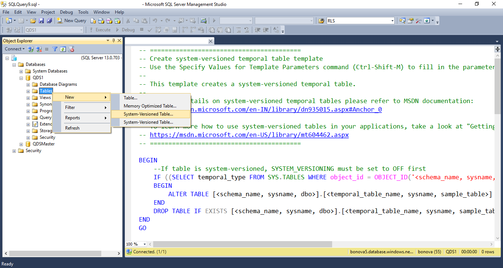
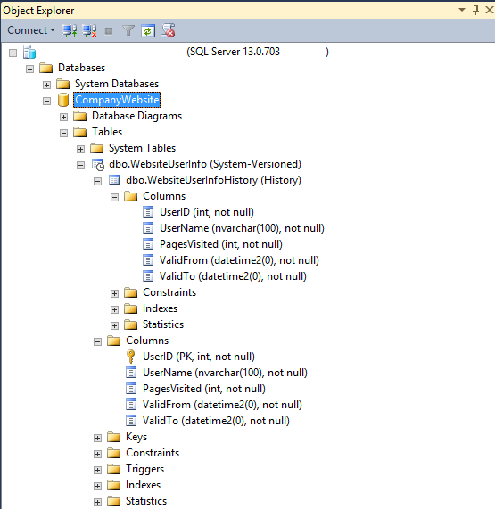

# Getting started with temporal tables
[!INCLUDE[appliesto-sqldb-sqlmi-fabricsqldb](includes/appliesto-sqldb-sqlmi-fabricsqldb.md)]

Temporal tables are a programmability feature that allows you to track and analyze the full history of changes in your data, without the need for custom coding. Temporal tables keep data closely related to time context so that stored facts can be interpreted as valid only within the specific period. This property of temporal tables allows for efficient time-based analysis and getting insights from data evolution.

## Temporal scenario

This article illustrates the steps to utilize temporal tables in an application scenario. Suppose that you want to track user activity on a new website that is being developed from scratch or on an existing website that you want to extend with user activity analytics. In this simplified example, we assume that the number of visited web pages during a period of time is an indicator that needs to be captured and monitored in the website database that is hosted on Azure SQL Database or Azure SQL Managed Instance. The goal of the historical analysis of user activity is to get inputs to redesign website and provide better experience for the visitors.

The database model for this scenario is simple - user activity metric is represented with a single integer field, **PageVisited**, and is captured along with basic information on the user profile. Additionally, for time-based analysis, you would keep a series of rows for each user, where every row represents the number of pages a particular user visited within a specific period of time.


Fortunately, you don't need to put any effort in your app to maintain this activity information. With temporal tables, this process is automated - giving you full flexibility during website design and more time to focus on the data analysis itself. The only thing you have to do is to ensure that `WebSiteInfo` table is configured as [temporal system-versioned](/sql/relational-databases/tables/temporal-tables#what-is-a-system-versioned-temporal-table). The exact steps to utilize temporal tables in this scenario are described below.

## Step 1: Configure tables as temporal

Depending on whether you're starting new development or upgrading existing application, you'll either create temporal tables or modify existing ones by adding temporal attributes. In general case, your scenario can be a mix of these two options. Perform these action using [SQL Server Management Studio](/sql/ssms/download-sql-server-management-studio-ssms) (SSMS), [SQL Server Data Tools](/sql/ssdt/download-sql-server-data-tools-ssdt) (SSDT), [Azure Data Studio](/azure-data-studio/download-azure-data-studio),  or any other Transact-SQL development tool.

> [!IMPORTANT]
> It is recommended that you always use the latest version of Management Studio to remain synchronized with updates to Azure SQL Database and Azure SQL Managed Instance. [Update SQL Server Management Studio](/sql/ssms/download-sql-server-management-studio-ssms).

### Create new table

Use context menu item "New System-Versioned Table" in SSMS Object Explorer to open the query editor with a temporal table template script and then use "Specify Values for Template Parameters" (Ctrl+Shift+M) to populate the template:



In SSDT, choose "Temporal Table (System-Versioned)" template when adding new items to the database project. That will open table designer and enable you to easily specify the table layout:


You can also create temporal table by specifying the Transact-SQL statements directly, as shown in the example below. The mandatory elements of every temporal table are the PERIOD definition and the SYSTEM_VERSIONING clause with a reference to another user table that will store historical row versions:

```sql
CREATE TABLE WebsiteUserInfo
(  
    [UserID] int NOT NULL PRIMARY KEY CLUSTERED
  , [UserName] nvarchar(100) NOT NULL
  , [PagesVisited] int NOT NULL
  , [ValidFrom] datetime2 (0) GENERATED ALWAYS AS ROW START
  , [ValidTo] datetime2 (0) GENERATED ALWAYS AS ROW END
  , PERIOD FOR SYSTEM_TIME (ValidFrom, ValidTo)
 )  
 WITH (SYSTEM_VERSIONING = ON (HISTORY_TABLE = dbo.WebsiteUserInfoHistory));
```

When you create system-versioned temporal table, the accompanying history table with the default configuration is automatically created. The default history table contains a clustered B-tree index on the period columns (end, start) with page compression enabled. This configuration is optimal for most scenarios in which temporal tables are used, especially for [data auditing](/sql/relational-databases/tables/temporal-table-usage-scenarios#enabling-system-versioning-on-a-new-table-for-data-audit).

In this particular case, we aim to perform time-based trend analysis over a longer data history and with bigger data sets, so the storage choice for the history table is a clustered columnstore index. A clustered columnstore provides good compression and performance for analytical queries. Temporal tables give you the flexibility to configure indexes on the current and temporal tables completely independently.

> [!NOTE]
> Columnstore indexes are available in the Business Critical, General Purpose, and Premium tiers and in the Standard tier, S3 and above.

The following script shows how default index on history table can be changed to the clustered columnstore:

```sql
CREATE CLUSTERED COLUMNSTORE INDEX IX_WebsiteUserInfoHistory
ON dbo.WebsiteUserInfoHistory
WITH (DROP_EXISTING = ON);
```

Temporal tables are represented in the Object Explorer with the specific icon for easier identification, while its history table is displayed as a child node.



### Alter existing table to temporal

Let's cover the alternative scenario in which the WebsiteUserInfo table already exists, but wasn't designed to keep a history of changes. In this case, you can simply extend the existing table to become temporal, as shown in the following example:

```sql
ALTER TABLE WebsiteUserInfo
ADD
    ValidFrom datetime2 (0) GENERATED ALWAYS AS ROW START HIDDEN  
        constraint DF_ValidFrom DEFAULT DATEADD(SECOND, -1, SYSUTCDATETIME())
    , ValidTo datetime2 (0)  GENERATED ALWAYS AS ROW END HIDDEN
        constraint DF_ValidTo DEFAULT '9999.12.31 23:59:59.99'
    , PERIOD FOR SYSTEM_TIME (ValidFrom, ValidTo);

ALTER TABLE WebsiteUserInfo  
SET (SYSTEM_VERSIONING = ON (HISTORY_TABLE = dbo.WebsiteUserInfoHistory));
GO

CREATE CLUSTERED COLUMNSTORE INDEX IX_WebsiteUserInfoHistory
ON dbo.WebsiteUserInfoHistory
WITH (DROP_EXISTING = ON);
```

## Step 2: Run your workload regularly

The main advantage of temporal tables is that you don't need to change or adjust your website in any way to perform change tracking. Once created, temporal tables transparently persist previous row versions every time you perform modifications on your data.

In order to leverage automatic change tracking for this particular scenario, let's just update column **PagesVisited** every time a user ends their session on the website:

```sql
UPDATE WebsiteUserInfo  SET [PagesVisited] = 5
WHERE [UserID] = 1;
```

It's important to notice that the update query doesn't need to know the exact time when the actual operation occurred nor how historical data will be preserved for future analysis. Both aspects are automatically handled by Azure SQL Database and Azure SQL Managed Instance. The following diagram illustrates how history data is being generated on every update.


## Step 3: Perform historical data analysis

Now when temporal system-versioning is enabled, historical data analysis is just one query away from you. In this article, we'll provide a few examples that address common analysis scenarios - to learn all details, explore various options introduced with the [FOR SYSTEM_TIME](/sql/relational-databases/tables/temporal-tables#how-do-i-query-temporal-data) clause.

To see the top 10 users ordered by the number of visited web pages as of an hour ago, run this query:

```sql
DECLARE @hourAgo datetime2 = DATEADD(HOUR, -1, SYSUTCDATETIME());
SELECT TOP 10 * FROM dbo.WebsiteUserInfo FOR SYSTEM_TIME AS OF @hourAgo
ORDER BY PagesVisited DESC
```

You can easily modify this query to analyze the site visits as of a day ago, a month ago or at any point in the past you wish.

To perform basic statistical analysis for the previous day, use the following example:

```sql
DECLARE @twoDaysAgo datetime2 = DATEADD(DAY, -2, SYSUTCDATETIME());
DECLARE @aDayAgo datetime2 = DATEADD(DAY, -1, SYSUTCDATETIME());

SELECT UserID, SUM (PagesVisited) as TotalVisitedPages, AVG (PagesVisited) as AverageVisitedPages,
MAX (PagesVisited) AS MaxVisitedPages, MIN (PagesVisited) AS MinVisitedPages,
STDEV (PagesVisited) as StDevViistedPages
FROM dbo.WebsiteUserInfo
FOR SYSTEM_TIME BETWEEN @twoDaysAgo AND @aDayAgo
GROUP BY UserId
```

To search for activities of a specific user, within a period of time, use the CONTAINED IN clause:

```sql
DECLARE @hourAgo datetime2 = DATEADD(HOUR, -1, SYSUTCDATETIME());
DECLARE @twoHoursAgo datetime2 = DATEADD(HOUR, -2, SYSUTCDATETIME());
SELECT * FROM dbo.WebsiteUserInfo
FOR SYSTEM_TIME CONTAINED IN (@twoHoursAgo, @hourAgo)
WHERE [UserID] = 1;
```

Graphic visualization is especially convenient for temporal queries as you can show trends and usage patterns in an intuitive way very easily:


## Evolving table schema

Typically, you'll need to change the temporal table schema while you're doing app development. For that, simply run regular ALTER TABLE statements and Azure SQL Database or Azure SQL Managed Instance appropriately propagates changes to the history table. The following script shows how you can add additional attribute for tracking:

```sql
/*Add new column for tracking source IP address*/
ALTER TABLE dbo.WebsiteUserInfo
ADD  [IPAddress] varchar(128) NOT NULL CONSTRAINT DF_Address DEFAULT 'N/A';
```

Similarly, you can change column definition while your workload is active:

```sql
/*Increase the length of name column*/
ALTER TABLE dbo.WebsiteUserInfo
    ALTER COLUMN  UserName nvarchar(256) NOT NULL;
```

Finally, you can remove a column that you don't need anymore.

```sql
/*Drop unnecessary column */
ALTER TABLE dbo.WebsiteUserInfo
    DROP COLUMN TemporaryColumn;
```

Alternatively, use latest [SSDT](/sql/ssdt/download-sql-server-data-tools-ssdt) to change temporal table schema while you're connected to the database (online mode) or as part of the database project (offline mode).

## Controlling retention of historical data

With system-versioned temporal tables, the history table might increase the database size more than regular tables. A large and ever-growing history table can become an issue both due to pure storage costs as well as imposing a performance tax on temporal querying. Hence, developing a data retention policy for managing data in the history table is an important aspect of planning and managing the lifecycle of every temporal table. With Azure SQL Database and Azure SQL Managed Instance, you have the following approaches for managing historical data in the temporal table:

- [Table Partitioning](/sql/relational-databases/tables/manage-retention-of-historical-data-in-system-versioned-temporal-tables#using-table-partitioning-approach)
- [Custom Cleanup Script](/sql/relational-databases/tables/manage-retention-of-historical-data-in-system-versioned-temporal-tables#using-custom-cleanup-script-approach)

## Remarks

In both [Azure SQL Database configured for mirroring into Fabric](/sql/sql-server/fabric-database/fabric-mirrored-databases) and [Fabric SQL database](/fabric/database/sql/overview), you can create temporal tables, but the respective history tables aren't mirrored to Fabric OneLake. For specific behavior around setting the `SYSTEM_VERSIONING` flag on temporal tables, see [Create a system-versioned temporal table](/sql/relational-databases/tables/creating-a-system-versioned-temporal-table?view=fabric&preserve-view=true).

## Related content

- For more information on temporal tables, see [Temporal Tables](/sql/relational-databases/tables/temporal-tables).
